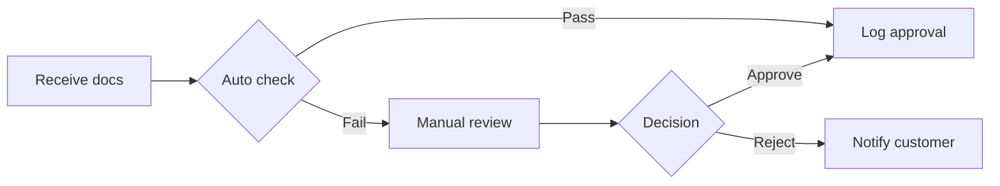

## Overview

Identity verification is performed against government-issued ID and checked against the fraud watchlist. This step is a subprocess — see the **Identity Verification** process for full detail.

## Key checks

- Document authenticity (automated OCR + manual review for high-risk)
- Name and DOB match between ID and application form
- Fraud watchlist check (internal + external bureau)
- PEP / sanctions screening

## SLA

Identity verification must be completed within **4 business hours** of application receipt.

## Escalation

If verification fails or cannot be confirmed automatically, escalate to the Compliance team via the case management system with reason code `IDV-FAIL`.

